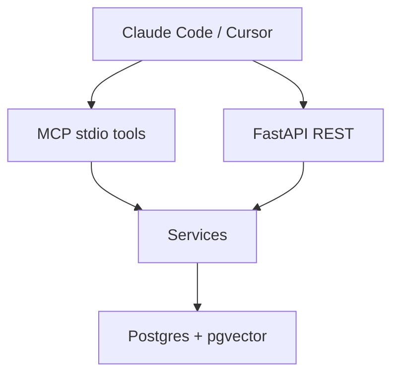
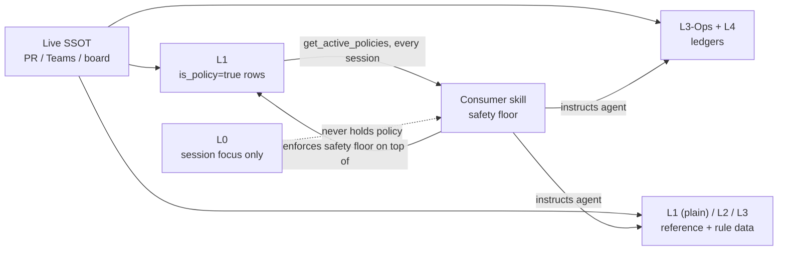
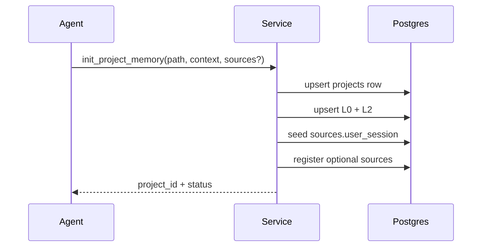
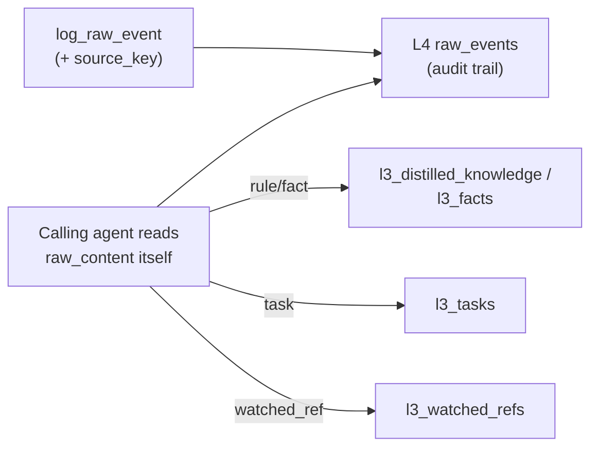

# Agentic Memory Service MCP

A Hierarchical, Agentic Memory Service designed to attach to Claude Code or Cursor via the Model Context Protocol (MCP). Protects LLM context windows while providing deep, project-specific operational memory. Built for Enterprise scale with automated retention and resilient APIs.

## Features
- **Project-scoped memory:** every row is tied to a `projects` registry (`project_id` + denormalized `project_path`) so multiple projects never mix.
- **Layered knowledge store:** L0 working focus, L1 curated reference (incl. per-project policy), L2 rules/context, L3 distilled rules, L3-Ops typed ledgers, L4 raw event lake.
- **Data sources registry:** declare where facts come from (GitHub PR, Teams, Jira, local files, live `user_session`) and how to re-read them.
- **Hybrid Search:** pgvector + pg_trgm on L3 rules and L3-Ops facts/tasks/refs.
- **Agent-driven writes:** the calling agent reads a raw event itself and writes structured L3/Ops rows directly (`upsert_fact`/`upsert_task`/`upsert_watched_ref`/`upsert_distilled_rule`) — no automatic LLM distillation pass.
- **Context window protection:** sanitization, truncation (1500 chars), search/SQL hard limits.
- **Auto retention:** L4 monthly partitions; drop partitions older than 6 months.

## Architecture overview

### How pieces fit together



### Memory layers (read top → bottom for “what agent uses first”)

| Layer | Table(s) | Role | Typical ops |
| --- | --- | --- | --- |
| **Registry** | `projects`, `sources` | Identity + provenance. `sources` stores connection config + `read_recipe` to re-fetch live data. | `init_project_memory`, `register_data_source`, `list_data_sources` |
| **L0** | `l0_working_memory` | **Session focus only** (`current_focus_text`). Not for policies, rules, or anything a future session needs to recover. | `update_working_memory` |
| **L1** | `l1_references` | Curated reference docs, one row per named `ref_key` per project: rosters, seat commitments/DoD, source read-recipe guides, and **project-specific policy/workflow** (`is_policy=true` rows). | `upsert_l1_reference`, `get_l1_reference`, `list_l1_references`, `search_l1_references`, `get_active_policies` |
| **L2** | `l2_meta_memory` | Project rules, conventions, structure (stable *data* context) | set at `init_project_memory` |
| **L3** | `l3_distilled_knowledge` | Atomic distilled rules (semantic + keyword search) | `search_memory`, `upsert_distilled_rule` |
| **L3-Ops** | `l3_watermarks`, `l3_facts`, `l3_tasks`, `l3_watched_refs` | Typed operational ledgers (cursors, decisions/plans, open-loops, watched refs) | watermark / fact / task / watched-ref tools |
| **L4** | `l4_raw_events` (partitioned) | Append-only raw payloads; 6-month retention | `log_raw_event`, `get_raw_context`, `query_deep_memory_sql` |
| **Policy / workflow** | **L1** (`is_policy=true` rows), loaded every session via `get_active_policies` | Project-specific write-gates, phase rules, escalation contacts — one generic consumer skill loads whichever project's policy applies by switching `project_path`. The consumer skill still enforces the universal safety floor (write-class confirmation, no destructive action without approval) that stored policy can never relax. | `get_active_policies`, `upsert_l1_reference(..., is_policy=true)` |

### Policy & workflow — not L0

**Do not store policies or workflows in L0.** L0 is a single overwriteable scratchpad per project. Putting “confirm before post”, hard-stops, or sweep procedures there mixes them with session focus and they get wiped on the next `update_working_memory`. Project-specific policy/workflow belongs in **L1** instead (`is_policy=true` rows) — see the table above.

| Concern | Where it lives | xora-dev equivalent |
| --- | --- | --- |
| Executable policy (grounded-or-silent, write-gate, hard-stops, phase-aware claiming, coverage footer) | **L1** `is_policy=true` rows (loaded via `get_active_policies` every session) + the consumer skill's retained universal safety floor | `xora-dev/SKILL.md` §§1,3,7–9 |
| Stable cited playbooks (comment grammar, roster, seat DoD, read recipes as *data*) | **L1** (plain reference rows) | `references/PROTOCOL.md`, `ROSTER.md`, `MY-WORK.md`, `SOURCES.md` |
| Fast-moving ledgers | L3-Ops + L4 | `state/*` |
| “What am I doing *this* session?” | L0 only | (no durable file; optional one-liner) |

**Update rules** (same discipline as xora-dev writing to `references/` / `state/`):

1. **Live source wins.** PR body / comment / Teams / board is SSOT; memory and skill text are caches.
2. **Correct in place.** When a live ruling contradicts L1/L2/L3/Ops or a skill-noted fact, overwrite the current value — do not append “previously we thought…”.
3. **Cite or don’t claim.** Every durable rule/fact must keep provenance (`source_id` / `raw_event_id` / URL in content). Unverifiable → re-fetch or drop.
4. **Policy edits are deliberate.** Changing a project's write-gates/hard-stops/sweep order means calling `upsert_l1_reference` on the relevant `is_policy=true` row — always show the exact resulting text and get explicit confirmation first, every time. Plain (non-policy) L1 references can be corrected in place freely. Never put policy in L0.
5. **Watermarks & tasks:** advance cursors only for what was actually read; soft-close tasks when the live source closes the loop (same honesty as xora-dev §6).



**Reference chain:** upper tiers point downward so the agent can jump from a compact Ops/L3 row to the raw event and to the source’s `read_recipe` when content may be stale (`source_id`, `raw_event_id`, dual hashes).

### L3-Ops tables (typed siblings)

| Table | Mirrors (e.g. war-room skill) | Notes |
| --- | --- | --- |
| `l3_watermarks` | incremental cursors | Structured JSON cursors; **no** embedding; ordered by `checked_at` |
| `l3_facts` | journal / decisions | Single table + `kind`: `fact` \| `decision` \| `plan` \| `question` \| `issue` \| `solution`; order by date or priority; hybrid search |
| `l3_tasks` | open-loops | Stable `task_key` (e.g. `O-28`); `open` / `partial` / `closed` |
| `l3_watched_refs` | watched refs | PR / issue / SHA / path / ticket / tag; disposition `mine` \| `queued` \| `resolved`; `why` (tracking reason) and `status_note` (latest state) update independently |

### Main activity flows

**1. Bootstrap a project**



**2. Ingest → agent reads → agent writes structured rows**



There is no background or automatic LLM distillation step — `log_raw_event` only appends to L4 for
provenance/audit. The agent that read the source material is the one that decides what's atomic and
writes it directly, citing `raw_event_id` for provenance.

**3. Day-to-day agent loop**

1. `search_memory` / `search_facts` / `list_tasks` — cheap context before big changes  
2. Work against live tools (gh, Teams, …) using each source’s `read_recipe`  
3. `upsert_watermark` after incremental reads  
4. `log_raw_event` or typed `upsert_fact` / `upsert_task` / `upsert_watched_ref` when something must stick  
5. `update_working_memory` for the current session focus  
6. If a search hit is truncated → `get_raw_context(raw_event_id)`

**4. First-time full ingest & full reindex** (agent-driven; service does not call gh/Teams itself)

Defined in the agentic-memory skill § *Full ingest & reindex*:

- **Full ingest:** after init, for each active source except `user_session` → execute `read_recipe` → `log_raw_event` / Ops upserts → `upsert_watermark` (honest `indexed_through` vs `full_read_ids`) → coverage footer.
- **Incremental:** if a watermark exists, fetch only after the cursor.
- **Full reindex:** cold-start re-read (ignore old cursor as lower bound), re-run ingest, overwrite watermarks, soft-close contradicted tasks; say it was a reindex in the coverage footer.

### Tool surface (MCP ↔ REST)

| Concern | MCP tools | REST (under `/projects/{project_path}/…`) |
| --- | --- | --- |
| Bootstrap / focus | `init_project_memory`, `update_working_memory` | `POST …/init`, `PATCH …/working-memory` |
| Sources | `register_data_source`, `list_data_sources` | `POST …/sources`, `GET …/sources` |
| Raw events | `log_raw_event`, `get_raw_context`, `query_deep_memory_sql` | `POST …/events`, `GET …/raw-events/{id}`, `POST …/sql` |
| L1 references / policy | `upsert_l1_reference`, `get_l1_reference`, `list_l1_references`, `search_l1_references`, `get_active_policies` | `POST/GET …/l1-references`, `GET …/l1-references/{ref_key}`, `GET …/l1-references/search`, `GET …/l1-references/policies` |
| L3 rules | `search_memory`, `upsert_distilled_rule` | `GET …/search`, `POST …/rules` |
| Watermarks | `upsert_watermark`, `get_watermark`, `list_watermarks` | `PUT …/watermarks`, `GET …/watermarks`, `GET …/watermarks/{source_key}` |
| Facts | `upsert_fact`, `search_facts` | `POST …/facts`, `GET …/facts/search` |
| Tasks | `upsert_task`, `close_task`, `list_tasks` | `POST …/tasks`, `POST …/tasks/{key}/close`, `GET …/tasks` |
| Watched refs | `upsert_watched_ref`, `list_watched_refs` | `POST …/watched-refs`, `GET …/watched-refs` |

Callers always pass **`project_path`** (absolute path of the consumer project). The service resolves/creates `project_id` internally.

## Prerequisites
- [uv](https://docs.astral.sh/uv/) installed
- Docker (for Postgres + pgvector)
- An OpenAI-compatible API key (used via LiteLLM for embeddings) — can point at a local embedding model instead

## Installation & Setup

### 1. Start Database
```bash
make db-up
```

### 2. Sync Dependencies & Configure
```bash
make sync
cp .env.example .env   # Add OPENAI_API_KEY; set MEMORY_API_KEY before any remote REST exposure
make migrate
```

**Security notes (REST vs MCP):**
- **MCP stdio** (`make mcp`) is a local process trust boundary — no network listener.
- **REST** has no user/multi-tenant model beyond `project_path`. Before binding beyond localhost (`APP_HOST=0.0.0.0` or a public reverse proxy), set a strong `MEMORY_API_KEY` and send it as `X-API-Key` or `Authorization: Bearer`. Prefer TLS termination (mTLS/OAuth at the proxy) for production.

### 3. Run Server
```bash
make run
```
*(The background scheduler will automatically bootstrap your initial database partitions upon startup).*

### 4. Run MCP Server (stdio)
```bash
make mcp
```

### Useful Make Targets
| Target | Description |
|--------|-------------|
| `make sync` | Install/sync Python deps with uv |
| `make run` | Start FastAPI with uvicorn (reload) |
| `make mcp` | Start MCP stdio server |
| `make migrate` | Run Alembic migrations |
| `make db-up` / `make db-down` | Start/stop Postgres+pgvector |
| `make build` | Build the app Docker image |
| `make test` | Run pytest |

## Integration

### A) Copy-paste prompts for your agent (Claude / Cursor)

Paste **one** of the prompts below into Claude Code or Cursor. The agent should do the wiring for you — do not configure MCP/REST manually unless the agent asks for a path or URL you must fill in.

#### Prompt 1 — Local MCP (stdio) on this machine

```text
Connect this project to the local Hierarchical Agentic Memory Service via MCP (stdio).

Do all of the following for me (edit files yourself; ask me only if a path is missing):

1) Install the agentic-memory skill into THIS consumer project:
   - Claude Code: create `.claude/skills/agentic-memory/SKILL.md`
   - Cursor: create `.cursor/skills/agentic-memory/SKILL.md`
   Source of truth (fetch if needed):
   https://raw.githubusercontent.com/NamTranQuoc/wn-project-memory/main/.claude/skills/agentic-memory/SKILL.md
   (Cursor may use the same content under `.cursor/skills/agentic-memory/SKILL.md`)

2) Register an MCP server named `agentic-memory` that runs stdio against the local memory repo.
   Absolute path to the memory service repo (replace if different on my machine):
   `/Users/namtran/personal/project/wn-project-memory`
   Command:
   - cwd: that repo path
   - command: `uv`
   - args: `["run", "python", "-m", "src.mcp_server"]`
   Wire this into the correct editor config (Cursor MCP settings / Claude Code MCP config). Do not start a long-lived process in the chat; just write the config so the editor can spawn stdio MCP.

3) Prerequisites I already handle outside the editor (mention if missing, do not invent secrets):
   - Postgres for the memory service is up
   - `.env` in the memory repo has `LITELLM_API_BASE` / models set
   - I can run `make mcp` manually to smoke-test, but prefer editor-managed stdio via the MCP config you write

4) After wiring, follow the agentic-memory skill: on first use call `init_project_memory` with this project's absolute path, then `get_active_policies` (treat any result as binding for the session), then use `search_memory` / `log_raw_event` / `update_working_memory` as appropriate.
```

#### Prompt 2 — Remote / server via REST (no local MCP stdio)

```text
Connect this project to the Hierarchical Agentic Memory Service over REST (service runs on a server; no MCP stdio on my laptop).

Do all of the following for me:

1) Install the agentic-memory skill into THIS consumer project (same as local):
   - Claude: `.claude/skills/agentic-memory/SKILL.md`
   - Cursor: `.cursor/skills/agentic-memory/SKILL.md`
   Fetch from:
   https://raw.githubusercontent.com/NamTranQuoc/wn-project-memory/main/.claude/skills/agentic-memory/SKILL.md

2) Treat the memory tools as HTTP calls to the FastAPI base URL I give you (ask me once if unknown).
   Default local example: `http://localhost:8000`
   Production MUST be HTTPS behind a reverse proxy (or equivalent TLS), with MEMORY_API_KEY set on the server.
   Ask me for MEMORY_API_KEY once; send it on every memory call as header `X-API-Key: <key>`
   (or `Authorization: Bearer <key>`). Never invent a key. `/health` and `/ready` may be unauthenticated.
   Base path patterns (URL-encode project_path when it contains slashes):
   - POST   `{BASE}/projects/{project_path}/init`                 body: {"initial_context":"...","sources":[...]}
   - POST   `{BASE}/projects/{project_path}/events`               body: {"event_type":"...","content":"...","source_key":null}
   - GET    `{BASE}/projects/{project_path}/search?query=...&search_type=hybrid&limit=5`
   - POST   `{BASE}/projects/{project_path}/sql`                  body: {"sql_query":"SELECT ..."}
   - GET    `{BASE}/projects/{project_path}/raw-events/{id}`
   - PATCH  `{BASE}/projects/{project_path}/working-memory`       body: {"current_focus_text":"..."}
   - POST/GET `{BASE}/projects/{project_path}/sources`
   - PUT/GET  `{BASE}/projects/{project_path}/watermarks`
   - POST/GET `{BASE}/projects/{project_path}/facts` (+ `…/facts/search`)
   - POST/GET `{BASE}/projects/{project_path}/tasks` (+ `…/tasks/{key}/close`)
   - POST/GET `{BASE}/projects/{project_path}/watched-refs`        body accepts optional `status_note`
   - POST/GET `{BASE}/projects/{project_path}/l1-references` (+ `…/l1-references/{ref_key}`, `…/l1-references/search`, `…/l1-references/policies`)
   - GET    `{BASE}/health` and `{BASE}/ready`

3) Create a small project helper the agent can reuse (prefer one file the skill can point at), e.g. `.claude/skills/agentic-memory/rest-client.md` or a tiny script, documenting:
   - BASE URL (from me)
   - MEMORY_API_KEY header requirement for non-health routes
   - that tool names in the skill map 1:1 to these REST endpoints
   - always pass this repo's absolute path as `project_path`
   - respect limits (search limit≤5, SQL auto LIMIT 10, truncated text → get raw event)

4) Do NOT configure MCP stdio for this mode. Operate only via REST + the skill rules (init → get_active_policies → search before big changes → log_raw_event on feedback → update_working_memory for scratchpad).

5) Smoke-check with GET `{BASE}/health`. If it fails, tell me the service is down; do not invent a working connection.
```

### B) Optional: fetch skill only (if you still want a one-liner)

**Claude Code**
```bash
mkdir -p .claude/skills/agentic-memory
curl -sSL https://raw.githubusercontent.com/NamTranQuoc/wn-project-memory/main/.claude/skills/agentic-memory/SKILL.md \
  -o .claude/skills/agentic-memory/SKILL.md
```

**Cursor**
```bash
mkdir -p .cursor/skills/agentic-memory
curl -sSL https://raw.githubusercontent.com/NamTranQuoc/wn-project-memory/main/.cursor/skills/agentic-memory/SKILL.md \
  -o .cursor/skills/agentic-memory/SKILL.md
```
