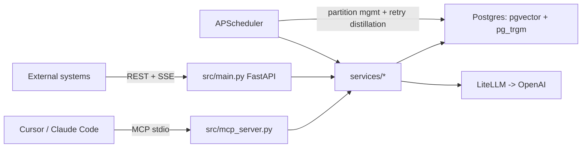

<!--
version: 20260801-hierarchical-agentic-memory-service
type: plan
date: 2026-08-01
source: .cursor/plans/hierarchical_agentic_memory_service_aa909f5d.plan.md
-->

# Implement Hierarchical Agentic Memory Service per spec-memory-agent.md

## Confirmed decisions
- LLM provider: **OpenAI** via LiteLLM for both distillation (chat) and embeddings.
- Git: `git init` + first commit after scaffold is working.
- Tooling: **uv** for Python env/deps (`pyproject.toml` + `uv.lock`), **Make** for all commands (`sync`, `run`, `build`, `migrate`, `mcp`, `db-up`, `db-down`, `test`).
- Docker: `docker-compose.yml` starts **only Postgres+pgvector**. A `Dockerfile` exists to build the app image (`make build`), but is not started by compose — app runs locally via `uv run uvicorn ...`.

## Architecture

Data flow for a rule: `log_raw_event` writes to L4 (`distillation_status=pending`) -> background task (APScheduler-triggered, retried via Tenacity) calls LiteLLM to split the raw text into atomic facts -> `upsert_distilled_rule` writes/overwrites L3 rows keyed by `(project_path, entity_key)` using dual-hash (`content_hash`, `source_hash`) -> `search_memory` queries L3 (pgvector HNSW + pg_trgm GIN) -> results sanitized/truncated to 1500 chars with `get_raw_context` pointer back to L4.

## File/module plan

### Mandatory config files (root)
- [CLAUDE.md](CLAUDE.md) — exact content from spec section 1.1.
- [.cursorrules](.cursorrules) — exact content from spec section 1.2.
- [memory_agent_skill.md](memory_agent_skill.md) — exact content from spec section 5 (the file users copy into their own projects), plus mention of `update_working_memory` tool.
- [README.md](README.md) — based on spec section 6, updated to reflect uv/Make workflow instead of pip/venv.
- `.env.example` / `.gitignore` (`.env`, `.venv`, `__pycache__`, etc.)

### Tooling
- `pyproject.toml` (uv-managed): fastapi, uvicorn[standard], sqlalchemy[asyncio], asyncpg, alembic, pgvector, pydantic-settings, litellm, mcp, apscheduler, tenacity, sse-starlette, psycopg[binary] (sync driver for Alembic).
- `Makefile`: `sync` (`uv sync`), `run` (`uv run uvicorn src.main:app --reload`), `mcp` (`uv run python -m src.mcp_server`), `migrate` (`uv run alembic upgrade head`), `db-up`/`db-down` (docker compose for Postgres only), `build` (`docker build -t memory-agent .`), `test` (`uv run pytest`).
- `Dockerfile`: multi-stage, `uv`-based install, runs `uvicorn src.main:app`.
- `docker-compose.yml`: single `postgres` service using `pgvector/pgvector:pg16` image, volume, env from `.env`.

### `src/core/`
- `config.py`: Pydantic `BaseSettings` — `DATABASE_URL`, `OPENAI_API_KEY`, `DISTILLATION_MODEL` (default `gpt-4o-mini`), `EMBEDDING_MODEL` (default `text-embedding-3-small`, dim 1536), retention/partition knobs.
- `db.py`: async SQLAlchemy engine/session factory, `get_session` dependency.
- `scheduler.py`: APScheduler instance; registers jobs on FastAPI startup: (1) monthly partition pre-creation for L4, (2) drop L4 partitions older than 6 months, (3) sweep `distillation_status IN (pending, failed)` for retry.

### `src/models/` (SQLAlchemy async models)
- `l1_working_memory.py`, `l2_meta_memory.py`: simple tables per spec columns.
- `l3_distilled_knowledge.py`: unique `(project_path, entity_key)`, `embedding Vector(1536)`, `content_hash`, `source_hash`, FK `raw_event_id`.
- `l4_raw_events.py`: declared with `postgresql_partition_by="RANGE (created_at)"`; `distillation_status` as native Postgres enum (`pending`, `processed`, `failed`).
- Alembic migration(s) creating extensions (`CREATE EXTENSION vector; CREATE EXTENSION pg_trgm;`), tables, indexes: B-Tree, HNSW (`USING hnsw (embedding vector_cosine_ops)`), GIN (`USING gin (content gin_trgm_ops)`), plus one initial monthly partition for L4.

### `src/services/`
- `sanitize.py`: `sanitize_and_truncate(text, max_len=1500)` appending `... [truncated, use get_raw_context to read full]`.
- `hashing.py`: `content_hash`/`source_hash` helpers (sha256).
- `memory_service.py`: `init_project_memory`, `update_working_memory`, `upsert_distilled_rule` (overwrite-if-hash-changed logic).
- `embedding_service.py` + `litellm_client.py`: thin LiteLLM wrapper for chat + embeddings, both wrapped with Tenacity retry (exponential backoff on rate limit/network errors).
- `distillation_service.py`: reads a pending L4 row, prompts LiteLLM to split into atomic facts (entity_key/content pairs), embeds each, calls `upsert_distilled_rule` per fact, marks L4 row `processed`/`failed`.
- `search_service.py`: `search_memory` with `search_type in {semantic, keyword, hybrid}` — semantic via pgvector cosine distance, keyword via `pg_trgm` similarity, hybrid merges+re-ranks; default `limit=5`, hard cap enforced server-side regardless of caller input.
- `sql_service.py`: `query_deep_memory_sql` — validates SELECT-only (reject any statement containing `;`, DDL/DML keywords), executes in a read-only transaction, force-injects `LIMIT 10` if absent.
- `partition_service.py`: create-next-month-partition, drop-partitions-older-than(months=6).

### MCP server — `src/mcp_server.py`
Using `mcp.server.fastmcp.FastMCP`, stdio transport, exposing the tools below (all outputs passed through `sanitize_and_truncate`):
1. `init_project_memory(project_path, initial_context)`
2. `upsert_distilled_rule(project_path, entity_key, content, raw_event_id, source_hash)`
3. `search_memory(project_path, query, search_type="hybrid", limit=5)`
4. `query_deep_memory_sql(project_path, sql_query)`
5. `log_raw_event(project_path, event_type, content, source_hash)` — enqueues distillation
6. `get_raw_context(project_path, raw_event_id)`
7. `update_working_memory(project_path, current_focus_text)` — referenced by the skill file's rule 5, not explicitly in the section-4 list but required for consistency.

### REST/SSE API — `src/main.py` + `src/routers/`
- `routers/memory.py`: REST mirrors of the same operations for external (non-MCP) ingestion — `POST /projects/{project_path}/init`, `POST /projects/{project_path}/events` (log_raw_event), `GET /projects/{project_path}/search`, `POST /projects/{project_path}/sql`, `GET /projects/{project_path}/raw-events/{id}`, `PATCH /projects/{project_path}/working-memory`.
- `routers/events_stream.py`: SSE endpoint (`sse-starlette`) streaming distillation status changes for a given raw event/project so external ingestion callers can watch a fact go `pending -> processed`.
- `routers/health.py`: liveness/readiness (checks DB connectivity).
- App startup event wires the scheduler (partition + retry jobs) and verifies Postgres extensions exist.

### Tests (`tests/`)
- Unit tests for `sanitize_and_truncate`, hashing/overwrite logic, SQL guard (`query_deep_memory_sql` LIMIT injection + rejection of unsafe statements), partition date math.
- Integration tests against the docker-compose Postgres for `init_project_memory` -> `log_raw_event` -> (mocked LiteLLM) distillation -> `search_memory`.

## Out of scope / assumptions
- No auth/multi-tenant user model beyond `project_path` scoping (matches spec).
- LiteLLM calls mocked in tests; real calls need `OPENAI_API_KEY` in `.env`.
- Since folder is currently empty besides the spec, no migration/compat concerns — this is a clean scaffold.
